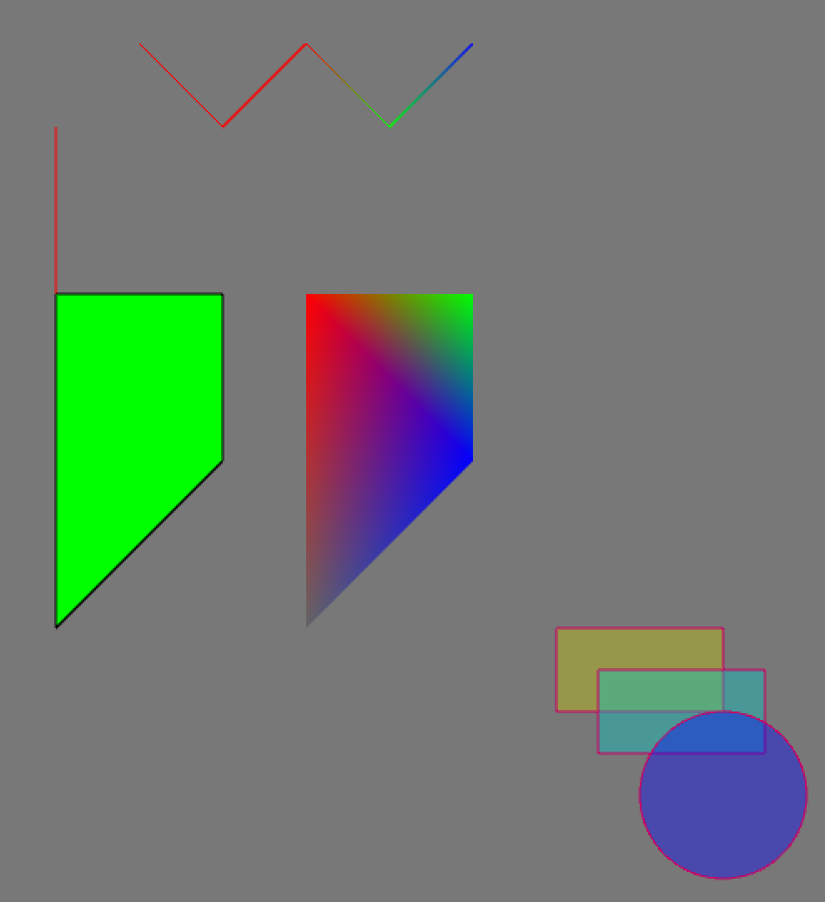
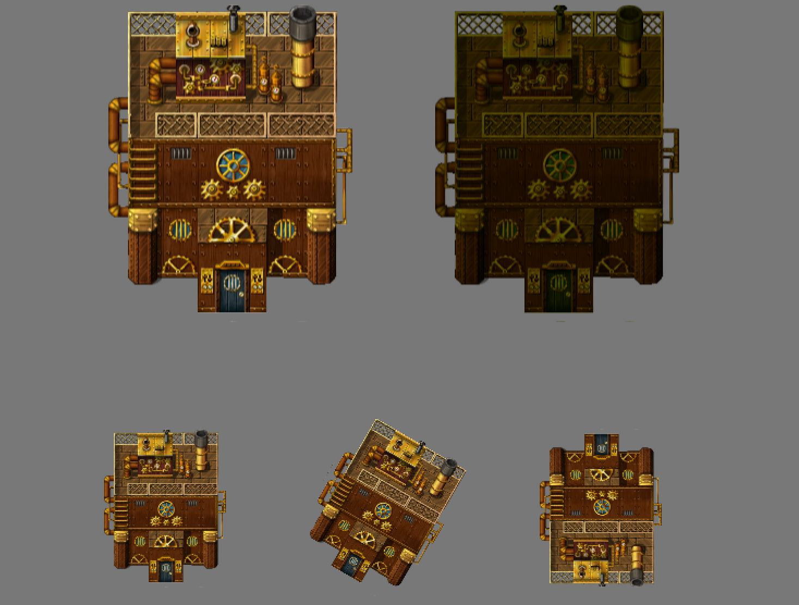

# TinyRenderer2D
[中文说明](./ReadMe_zh.md)

A tiny 2D renderer（600+ lines) based on OpenGL.It can use with libraries which support OpenGL.  

This renderer uses SDL's render API as a reference, and a little bit stronger than SDL :-).  

This renderer only need `glm` to build

## what can this renderer do

The renderer can:

* draw some basic shapes(rectangle, circle, line)
* give every point a color to let you draw some colorful shapes
* draw image and rotate/scale/flip them, or draw a part of them
* add extra color on image
* texture can be renderer's target to allow you using off-screen rendering
* color blend

## compile tests

dependences:  
* glm
* SDL2
* glew

At root dir, use `make` to compile tests

tests are:
* `hello_world`: a simple window that create renderer and clear the screen
* `draw_shapes`: show some draw shape functions
* `draw_images`: show how to draw image
* `target_texture`: show how to set a texture to renderer's target

## how to use

You must use `CreateRenderer()` to create a renderer after you inited OpenGL, and free it use `DestroyRenderer()`. 
Then you can use render like this:  

```c++
// using namespace
using namespace tinyrenderer2d;

// create render
Renderer* render = CreateRenderer(800, 600);

// in game loop
render->SetClearColor(255, 255, 255, 255);
render->Clear();    // clear screen
// use render draw something
render->DrawLines();

// destroy render
DestroyRenderer(render);
```

other main functions are in [include/tinyrenderer2d/renderer.hpp](include/tinyrenderer2d/renderer.hp) and [include/tinyrenderer2d/texture.hpp](include/tinyrenderer2d/texture.hpp)

## some snapshots

draw basic shapes




draw image



